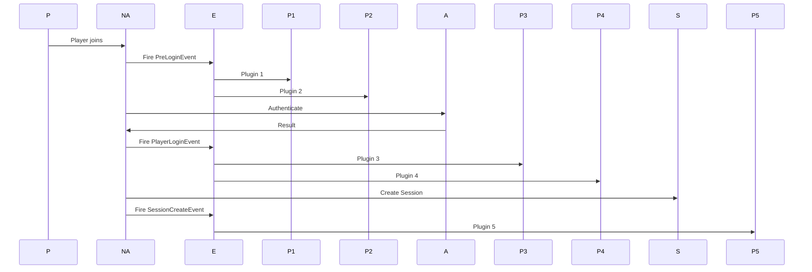

# Events System

NexAuth provides a comprehensive event system allowing plugins to react to authentication events and extend functionality.

## Event Categories

<Features>
  <Feature 
    icon="user"
    title="Authentication Events"
    description="Player login, registration, and logout events."
  />
  <Feature 
    icon="clock"
    title="Session Events"
    description="Session creation, expiration, and validation events."
  />
  <Feature 
    icon="shield"
    title="Security Events"
    description="Failed logins, brute force, and security events."
  />
</Features>

## Authentication Events

### Player Login Event

```java
@EventHandler
public void onPlayerLogin(PlayerLoginEvent event) {
    Player player = event.getPlayer();
    
    if (event.isSuccess()) {
        // Successful login
        getLogger().info(player.getName() + " logged in successfully");
        
        // Get login details
        long loginTime = event.getLoginTime();
        String ipAddress = event.getIpAddress();
        
        // Perform post-login actions
        giveWelcomeItems(player);
    } else {
        // Failed login
        getLogger().warning(player.getName() + " failed to login: " + event.getErrorMessage());
        
        // Handle failure
        notifyFailedLogin(player);
    }
}
```

### Player Register Event

```java
@EventHandler
public void onPlayerRegister(PlayerRegisterEvent event) {
    Player player = event.getPlayer();
    
    // New player registered
    getLogger().info(player.getName() + " registered new account");
    
    // Get registration details
    long registrationTime = event.getRegistrationTime();
    String ipAddress = event.getIpAddress();
    
    // Perform post-registration actions
    sendWelcomeMessage(player);
    giveStarterItems(player);
}
```

### Player Logout Event

```java
@EventHandler
public void onPlayerLogout(PlayerLogoutEvent event) {
    Player player = event.getPlayer();
    
    // Player logged out
    getLogger().info(player.getName() + " logged out");
    
    // Get logout details
    long logoutTime = event.getLogoutTime();
    long sessionDuration = event.getSessionDuration();
    
    // Perform post-logout actions
    savePlayerData(player);
}
```

## Session Events

### Session Create Event

```java
@EventHandler
public void onSessionCreate(SessionCreateEvent event) {
    Session session = event.getSession();
    Player player = session.getPlayer();
    
    // Session created
    getLogger().info("Session created for " + player.getName());
    
    // Get session details
    String sessionId = session.getId();
    long expiration = session.getExpirationTime();
    String ipAddress = session.getIpAddress();
    
    // Perform actions
    logSessionToDatabase(session);
}
```

### Session Expire Event

```java
@EventHandler
public void onSessionExpire(SessionExpireEvent event) {
    Session session = event.getSession();
    Player player = session.getPlayer();
    
    // Session expired
    getLogger().info("Session expired for " + player.getName());
    
    // Get expiration details
    long expirationTime = event.getExpirationTime();
    String reason = event.getReason();
    
    // Perform actions
    notifyPlayerSessionExpired(player);
    cleanupSessionData(session);
}
```

### Session Validate Event

```java
@EventHandler
public void onSessionValidate(SessionValidateEvent event) {
    Session session = event.getSession();
    String ipAddress = event.getIpAddress();
    
    // Session being validated
    if (event.isValid()) {
        getLogger().info("Session validated for " + session.getPlayerName());
    } else {
        getLogger().warning("Session validation failed for " + session.getPlayerName());
        
        // Cancel session validation
        event.setCancelled(true);
    }
}
```

## Security Events

### Failed Login Event

```java
@EventHandler
public void onFailedLogin(FailedLoginEvent event) {
    String username = event.getUsername();
    String ipAddress = event.getIpAddress();
    String reason = event.getReason();
    
    // Failed login attempt
    getLogger().warning("Failed login for " + username + " from " + ipAddress + ": " + reason);
    
    // Check for brute force
    int attempts = event.getAttempts();
    if (attempts >= 5) {
        // Too many attempts
        notifyAdmins(username, ipAddress, attempts);
        lockoutPlayer(username);
    }
}
```

### Brute Force Event

```java
@EventHandler
public void onBruteForce(BruteForceEvent event) {
    String identifier = event.getIdentifier();  // IP or username
    int attempts = event.getAttempts();
    long lockoutDuration = event.getLockoutDuration();
    
    // Brute force detected
    getLogger().warning("Brute force detected: " + identifier + " (" + attempts + " attempts)");
    
    // Perform actions
    notifyAdmins(identifier, attempts);
    blockIPAddress(identifier);
    logSecurityEvent(event);
}
```

### Password Change Event

```java
@EventHandler
public void onPasswordChange(PasswordChangeEvent event) {
    Player player = event.getPlayer();
    
    // Password changed
    getLogger().info(player.getName() + " changed password");
    
    // Perform actions
    invalidateOtherSessions(player);
    logPasswordChange(player);
    notifyPasswordChange(player);
}
```

## Two-Factor Authentication Events

### TOTP Enable Event

```java
@EventHandler
public void onTOTPEnable(TOTPEnableEvent event) {
    Player player = event.getPlayer();
    
    // 2FA enabled
    getLogger().info(player.getName() + " enabled 2FA");
    
    // Perform actions
    logSecurityEvent(player, "2FA enabled");
    updatePlayerSecurityLevel(player);
}
```

### TOTP Disable Event

```java
@EventHandler
public void onTOTPDisable(TOTPDisableEvent event) {
    Player player = event.getPlayer();
    
    // 2FA disabled
    getLogger().info(player.getName() + " disabled 2FA");
    
    // Perform actions
    logSecurityEvent(player, "2FA disabled");
    updatePlayerSecurityLevel(player);
}
```

### TOTP Verify Event

```java
@EventHandler
public void onTOTPVerify(TOTPVerifyEvent event) {
    Player player = event.getPlayer();
    
    if (event.isSuccess()) {
        // TOTP code verified
        getLogger().info(player.getName() + " verified 2FA code");
    } else {
        // Invalid TOTP code
        getLogger().warning(player.getName() + " failed 2FA verification");
        
        // Handle failure
        if (event.getAttempts() >= 3) {
            // Too many failed attempts
            player.kick("Too many failed 2FA attempts");
        }
    }
}
```

## Premium Events

### Premium Login Event

```java
@EventHandler
public void onPremiumLogin(PremiumLoginEvent event) {
    Player player = event.getPlayer();
    UUID premiumUUID = event.getPremiumUUID();
    
    // Premium player logged in
    getLogger().info("Premium player " + player.getName() + " logged in");
    
    // Perform actions
    updatePremiumData(player);
    loadPremiumSkin(player);
}
```

### Premium Link Event

```java
@EventHandler
public void onPremiumLink(PremiumLinkEvent event) {
    Player player = event.getPlayer();
    String offlineUsername = event.getOfflineUsername();
    
    // Premium account linked
    getLogger().info(player.getName() + " linked to premium account");
    
    // Perform actions
    migratePlayerData(offlineUsername, player);
    notifyLinkSuccess(player);
}
```

## Event Priorities

### Setting Priority

```java
// Monitor event (runs first)
@EventHandler(priority = EventPriority.MONITOR)
public void onLoginMonitor(PlayerLoginEvent event) {
    // Log all login attempts
}

// Highest priority (runs before most handlers)
@EventHandler(priority = EventPriority.HIGHEST)
public void onLoginHighest(PlayerLoginEvent event) {
    // Check if player is banned
}

// High priority
@EventHandler(priority = EventPriority.HIGH)
public void onLoginHigh(PlayerLoginEvent event) {
    // Check permissions
}

// Normal priority (default)
@EventHandler(priority = EventPriority.NORMAL)
public void onLoginNormal(PlayerLoginEvent event) {
    // Standard handling
}

// Low priority
@EventHandler(priority = EventPriority.LOW)
public void onLoginLow(PlayerLoginEvent event) {
    // Additional processing
}

// Lowest priority (runs last)
@EventHandler(priority = EventPriority.LOWEST)
public void onLoginLowest(PlayerLoginEvent event) {
    // Cleanup and final processing
}
```

### Canceling Events

```java
@EventHandler(priority = EventPriority.HIGHEST)
public void onPlayerLogin(PlayerLoginEvent event) {
    Player player = event.getPlayer();
    
    // Check if player is banned
    if (isBanned(player)) {
        event.setCancelled(true);
        event.setCancelMessage("You are banned from this server");
    }
}
```

## Async Events

### Async Event Handling

```java
@EventHandler(priority = EventPriority.MONITOR)
public void onPlayerLogin(PlayerLoginEvent event) {
    if (event.isSuccess()) {
        // Perform async operations
        Bukkit.getScheduler().runTaskAsynchronously(plugin, () -> {
            // Update external database
            updateExternalDatabase(event.getPlayer());
            
            // Send webhook notification
            sendWebhookNotification(event.getPlayer());
            
            // Log to external service
            logToExternalService(event.getPlayer());
        });
    }
}
```

## Event Flow Diagrams

### Login Flow



## Best Practices

<Checklist>
- ✅ Use appropriate event priorities
- ✅ Handle events efficiently
- ✅ Use async for heavy operations
- ✅ Check if event is cancelled
- ✅ Don't modify player data in MONITOR priority
- ✅ Handle exceptions gracefully
- ✅ Log security events
</Checklist>

## Next Steps

<Card title="Integration Guide" icon="puzzle" href="/nexauth/api/integrations">
Plugin integration examples and guides.
</Card>
