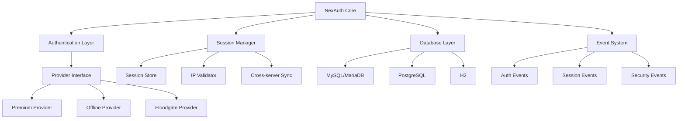
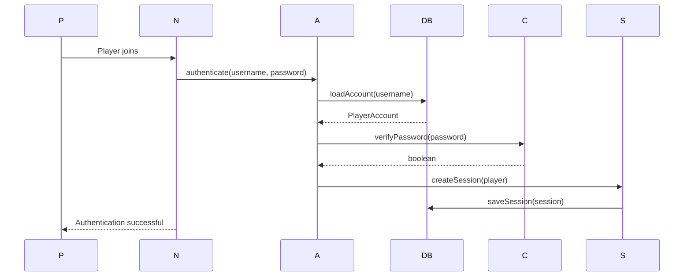
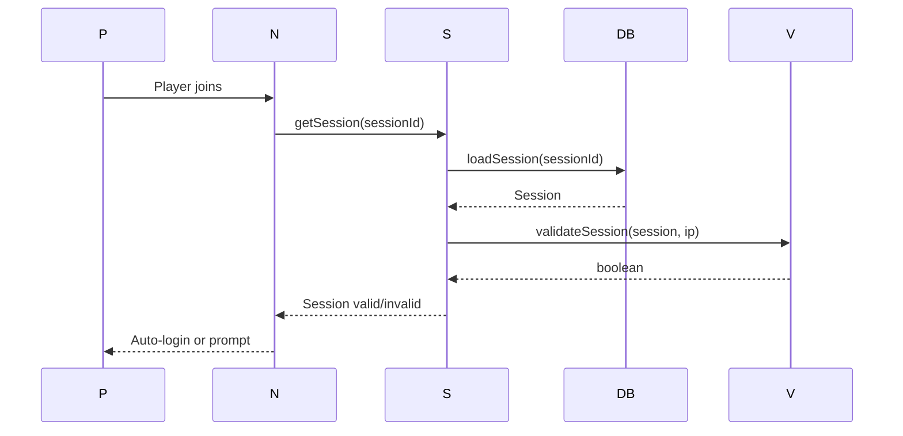

# Architecture

NexAuth is built with a modular, event-driven architecture that supports multiplatform deployment and extensibility.

## System Architecture



## Core Components

### Authentication Layer

Handles all authentication operations with provider abstraction:

```java
public interface AuthProvider {
    AuthResult authenticate(String username, String password);
    AuthResult register(String username, String password);
    boolean isPremium(String username);
    UUID getUUID(String username);
}
```

**Providers:**
- `PremiumAuthProvider` - Mojang authentication
- `OfflineAuthProvider` - Password-based authentication
- `FloodgateAuthProvider` - Bedrock player authentication

### Session Manager

Manages player sessions with persistence and validation:

```java
public class SessionManager {
    Session createSession(Player player, long duration);
    Session getSession(String sessionId);
    boolean validateSession(Session session, String ipAddress);
    void invalidateSession(String sessionId);
}
```

**Features:**
- Session persistence across restarts
- IP-based validation (optional)
- Cross-server session synchronization
- Automatic cleanup and expiration

### Database Layer

Abstract database interface supporting multiple backends:

```java
public interface Database {
    Optional<PlayerAccount> loadAccount(String username);
    void saveAccount(PlayerAccount account);
    Optional<Session> loadSession(String sessionId);
    void saveSession(Session session);
}
```

**Implementations:**
- MySQLDatabase - Production MySQL/MariaDB
- PostgreSQLDatabase - PostgreSQL support
- H2Database - Testing and development

### Event System

Event-driven architecture for extensibility:

```java
public class AuthEvents {
    // Player authentication events
    void onPlayerLogin(PlayerLoginEvent event);
    void onPlayerRegister(PlayerRegisterEvent event);
    void onPlayerLogout(PlayerLogoutEvent event);
    
    // Session events
    void onSessionCreate(SessionCreateEvent event);
    void onSessionExpire(SessionExpireEvent event);
    
    // Security events
    void onFailedLogin(FailedLoginEvent event);
    void onBruteForceDetected(BruteForceEvent event);
}
```

## Platform Integration

### Velocity Integration

```java
public class VelocityNexAuth {
    // Proxy-level authentication
    public void onPlayerJoin(PostLoginEvent event) {
        // Authenticate before server transfer
        AuthResult result = authProvider.authenticate(player);
        if (result.success()) {
            transferToBackend(player);
        }
    }
    
    // Cross-server session management
    public void syncSession(Player player, String backendServer) {
        // Share session across backend servers
    }
}
```

### Paper Integration

```java
public class PaperNexAuth extends JavaPlugin {
    // Server-level authentication
    public void onPlayerJoin(PlayerJoinEvent event) {
        // Authenticate locally or verify proxy session
    }
    
    // In-game commands
    public void registerCommands() {
        // Register /auth, /totp, /premium commands
    }
}
```

## Data Flow

### Authentication Flow



### Session Validation Flow



## Security Architecture

### Password Security

```java
public class CryptoService {
    // Bcrypt password hashing
    public String hashPassword(String password) {
        return BCrypt.hashpw(password, BCrypt.gensalt(12));
    }
    
    // Password verification
    public boolean verifyPassword(String password, String hash) {
        return BCrypt.checkpw(password, hash);
    }
    
    // AES-256 encryption for sensitive data
    public String encrypt(String data, String key);
    public String decrypt(String encryptedData, String key);
}
```

### Brute Force Protection

```java
public class BruteForceProtection {
    private Map<String, Integer> failedAttempts = new ConcurrentHashMap<>();
    private Map<String, Long> lockoutUntil = new ConcurrentHashMap<>();
    
    public void recordFailedAttempt(String identifier) {
        int attempts = failedAttempts.getOrDefault(identifier, 0) + 1;
        if (attempts >= maxAttempts) {
            lockout(identifier);
        }
    }
    
    public boolean isLockedOut(String identifier) {
        Long lockout = lockoutUntil.get(identifier);
        return lockout != null && lockout > System.currentTimeMillis();
    }
}
```

## Performance Optimization

### Caching Strategy

```java
public class CacheManager {
    private LoadingCache<String, PlayerAccount> accountCache;
    private LoadingCache<String, Session> sessionCache;
    
    public CacheManager() {
        accountCache = Caffeine.newBuilder()
            .maximumSize(1000)
            .expireAfterWrite(5, TimeUnit.MINUTES)
            .build(this::loadAccountFromDb);
            
        sessionCache = Caffeine.newBuilder()
            .maximumSize(5000)
            .expireAfterWrite(10, TimeUnit.MINUTES)
            .build(this::loadSessionFromDb);
    }
}
```

### Async Operations

```java
public class AsyncAuthService {
    private ExecutorService executor;
    
    public CompletableFuture<AuthResult> authenticateAsync(String username, String password) {
        return CompletableFuture.supplyAsync(() -> {
            return authProvider.authenticate(username, password);
        }, executor);
    }
}
```

## Extension Points

### Custom Auth Providers

```java
public class CustomAuthProvider implements AuthProvider {
    @Override
    public AuthResult authenticate(String username, String password) {
        // Custom authentication logic
        return AuthResult.success();
    }
    
    // Implement other methods...
}

// Register custom provider
NexAuth.getInstance().registerProvider("custom", new CustomAuthProvider());
```

### Event Listeners

```java
public class AuthListener implements Listener {
    @EventHandler
    public void onPlayerLogin(PlayerLoginEvent event) {
        // Custom login handling
        Player player = event.getPlayer();
        logger.info("Player " + player.getName() + " logged in");
    }
    
    @EventHandler
    public void onFailedLogin(FailedLoginEvent event) {
        // Log failed attempts, notify admins, etc.
    }
}

// Register listener
Bukkit.getPluginManager().registerEvents(new AuthListener(), plugin);
```

## Design Patterns

<AccordionGroup>
<Accordion title="Provider Pattern">

Authentication providers implement a common interface for extensibility.

**Benefits:**
- Easy to add new authentication methods
- Runtime provider selection
- Testable components

</Accordion>

<Accordion title="Event-Driven Architecture">

Loose coupling through events for extensibility.

**Benefits:**
- Plugins can react to auth events
- No modification of core code needed
- Async event processing

</Accordion>

<Accordion title="Repository Pattern">

Database abstraction for backend independence.

**Benefits:**
- Easy database backend switching
- Testable with mock repositories
- Centralized data access

</Accordion>

<Accordion title="Builder Pattern">

Configuration builders for complex object creation.

**Benefits:**
- Readable configuration code
- Immutable configuration objects
- Validation during build

</Accordion>
</AccordionGroup>

## Technology Stack

<Columns cols={2}>
<Card title="Core" icon="code">
- Java 17+
- Maven/Gradle
- SLF4J logging
</Card>

<Card title="Velocity" icon="zap">
- Velocity API
- Velocity proxy integration
- Cross-server messaging
</Card>

<Card title="Paper" icon="server">
- Paper API
- Spigot API
- Bukkit API
</Card>

<Card title="Database" icon="database">
- HikariCP connection pooling
- JDBC
- Database migrations
</Card>
</Columns>

## Next Steps

<Card title="Building from Source" icon="hammer" href="/nexauth/developers/building">
Build and compile NexAuth for development.
</Card>
