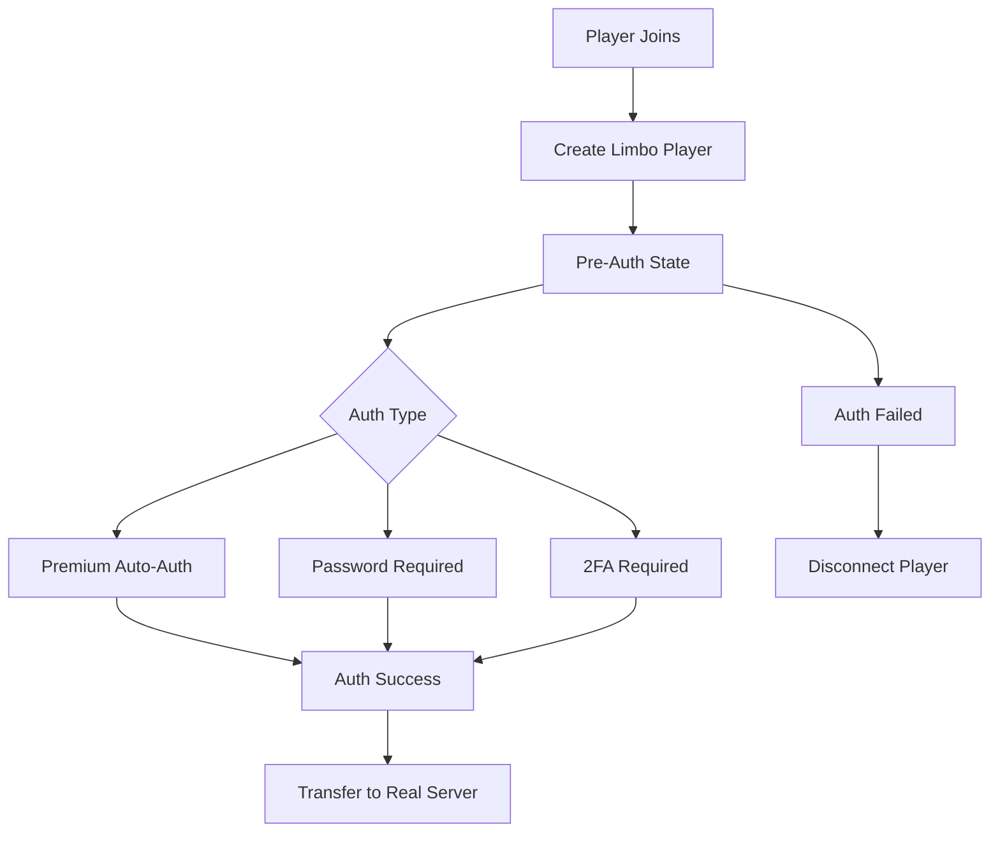
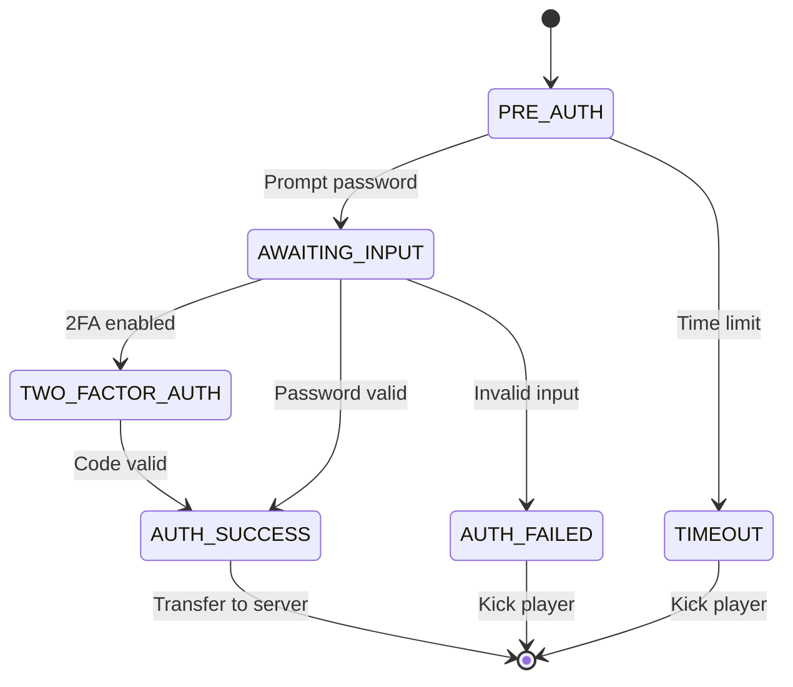

# Limbo Integration

NexAuth provides advanced integration with Limbo servers for pre-authentication player handling and state management.

## What is Limbo?

Limbo is a lightweight Minecraft server implementation that can handle players before they're fully authenticated. NexAuth uses Limbo to:

<Features>
  <Feature 
    icon="lock"
    title="Pre-Authentication State"
    description="Hold players in a controlled environment before authentication."
  />
  <Feature 
    icon="chat"
    title="Restricted Commands"
    description="Allow only authentication commands during limbo state."
  />
  <Feature 
    icon="eye-off"
    title="Invisible Players"
    description="Hide unauthenticated players from authenticated ones."
  />
</Features>

## Architecture



## Configuration

### Basic Setup

```hocon
# The authentication servers/worlds, players should be sent to when not authenticated
limbo=[
    limbo0,
    limbo1
]

# !!WHEN USING PAPER, PUT ALL WORLDS UNDER "root"!!

# Commands that are allowed while the user is not authorized
allowed-commands-while-unauthorized=[
    login,
    register,
    "2fa",
    "2faconfirm",
    l,
    log,
    reg
]
```

### Advanced Settings

```hocon
# Sets the login/register time limit in seconds. Set to negative to disable.
seconds-to-authorize=-1

# This specifies how often players should be notified when not authenticated
milliseconds-to-refresh-notification=10000

# Whether or not to use titles when player is awaiting authentication
use-titles=true

# Whether or not to use action bar when player is awaiting authentication
use-action-bar=false

# Should we hide the player's inventory on packet level while they are not authenticated?
hide-player-inventory=true
```

## Implementation

### Limbo Server Setup

<Steps>
<Step title="Install Limbo Plugin">
Install a Limbo plugin on your proxy or backend server.

Popular options:
- [Limbo](https://github.com/limbo-works/limbo)
- [LimboAPI](https://github.com/Elikill58/LimboAPI)
</Step>

<Step title="Configure Limbo">
Set up the Limbo server configuration.

```hocon
# NexAuth config.conf - Limbo servers
limbo=[
    limbo0,
    limbo1
]

# Velocity proxy config.toml
# [servers.limbo]
# address="127.0.0.1:25565"
```

</Step>

<Step title="Configure NexAuth">
Enable Limbo integration in NexAuth config.

```hocon
# The authentication servers/worlds, players should be sent to when not authenticated
limbo=[
    limbo0
]
```

</Step>

<Step title="Test Integration">
Verify players are transferred to Limbo before authentication.

</Step>
</Steps>

### Player Flow

```java
public class LimboIntegration {
    private final LimboServer limboServer;
    private final AuthManager authManager;
    
    public void handlePlayerJoin(Player player) {
        // Transfer to limbo
        transferToLimbo(player);
        
        // Start authentication timer
        startAuthTimeout(player);
    }
    
    private void transferToLimbo(Player player) {
        // Create limbo player instance
        LimboPlayer limboPlayer = limboServer.createPlayer(player);
        
        // Set limbo state
        limboPlayer.setLimboState(LimboState.PRE_AUTH);
        
        // Transfer player
        player.transfer(limboServer.getAddress());
    }
    
    public void handleAuthenticationSuccess(Player player) {
        // Transfer from limbo to real server
        transferToRealServer(player);
        
        // Clean up limbo instance
        limboServer.removePlayer(player);
    }
}
```

## Limbo State Management

### Player States

```java
public enum LimboState {
    PRE_AUTH,           // Before authentication
    AWAITING_INPUT,     // Waiting for password/code
    TWO_FACTOR_AUTH,    // 2FA verification
    AUTH_SUCCESS,       // Ready to transfer
    AUTH_FAILED,        // Authentication failed
    TIMEOUT             // Authentication timeout
}
```

### State Transitions



## Custom Limbo Features

### Custom Prompts

```hocon
# This specifies how often players should be notified when not authenticated
milliseconds-to-refresh-notification=10000

# Whether or not to use titles when player is awaiting authentication
use-titles=true

# Whether or not to use action bar when player is awaiting authentication
use-action-bar=false
```

### Limbo UI

```hocon
# Whether or not to use titles when player is awaiting authentication
use-titles=true

# Whether or not to use action bar when player is awaiting authentication
use-action-bar=false

# Should we hide the player's inventory on packet level while they are not authenticated?
hide-player-inventory=true
```

## Performance Optimization

### Resource Management

```hocon
# Should we ping servers to check if they are online and get their player count?
# !!THIS OPTION IS IRRELEVANT WHEN USING PAPER!!
ping-servers=false

# By default, when choosing available lobby/limbos NexAuth will rule out all the servers which are full.
ignore-max-players-from-backend-ping=false
```

### Async Operations

```java
public class AsyncLimboManager {
    private final ExecutorService executor;
    
    public CompletableFuture<Void> transferToLimboAsync(Player player) {
        return CompletableFuture.runAsync(() -> {
            transferToLimbo(player);
        }, executor);
    }
    
    public void handleAuthentication(Player player, String input) {
        executor.submit(() -> {
            AuthResult result = authManager.authenticate(player, input);
            
            Bukkit.getScheduler().runTask(plugin, () -> {
                handleAuthResult(player, result);
            });
        });
    }
}
```

## Troubleshooting

<AccordionGroup>
<Accordion title="Players stuck in limbo?">

**Check:**
1. Authentication is completing successfully
2. Server transfer is working
3. Network connectivity between servers

**Solutions:**
```hocon
# Sets the login/register time limit in seconds
seconds-to-authorize=-1

# Should we enable debug mode?
debug=true
```

</Accordion>

<Accordion title="Can't transfer from limbo?">

**Common causes:**
1. Server address misconfigured
2. Server offline
3. Player data not cleaned up

**Solutions:**
```hocon
# The authentication servers/worlds
limbo=[
    limbo0
]

# Should we fallback players to lobby servers if the server they are on shutdowns?
fallback=false
```

</Accordion>

<Accordion title="High memory usage?">

**Limbo player instances can consume memory.**

**Solutions:**
```hocon
# Should we ping servers to check if they are online?
ping-servers=false

# By default, when choosing available lobby/limbos NexAuth will rule out all the servers which are full.
ignore-max-players-from-backend-ping=false
```

</Accordion>
</AccordionGroup>

## Best Practices

<Checklist>
- ✅ Set appropriate timeout values
- ✅ Monitor limbo player count
- ✅ Enable cleanup processes
- ✅ Test with various auth scenarios
- ✅ Provide clear user instructions
- ✅ Handle edge cases (timeouts, disconnects)
</Checklist>

## Next Steps

<Card title="API Reference" icon="book" href="/nexauth/api/overview">
Explore the NexAuth API for custom integrations.
</Card>
