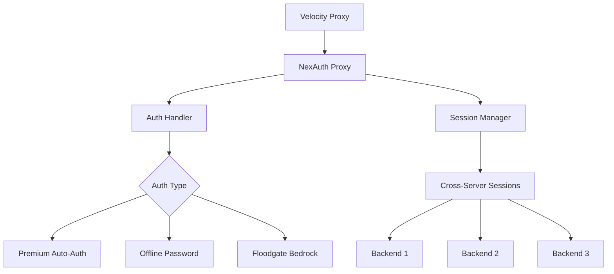
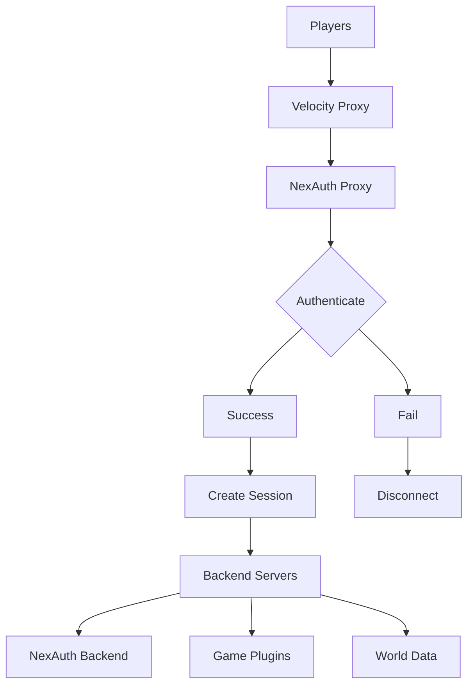

# Platform Support

NexAuth provides unified authentication across multiple Minecraft server platforms with platform-specific optimizations.

## Supported Platforms

<Columns cols={2}>
<Card title="Velocity" icon="zap" recommended={true}>
High-performance proxy with cross-server authentication and unified sessions.
</Card>

<Card title="Paper" icon="server">
Advanced server software with full feature support and optimized performance.
</Card>
</Columns>

## Velocity Platform

### Architecture



### Velocity-Specific Features

<Features>
  <Feature 
    icon="network"
    title="Cross-Server Authentication"
    description="Authenticate once at proxy level, access all backend servers."
  />
  <Feature 
    icon="sync"
    title="Unified Sessions"
    description="Shared session state across all backend servers."
  />
  <Feature 
    icon="zap"
    title="High Performance"
    description="Minimal overhead with async authentication."
  />
</Features>

### Implementation

```java
public class VelocityNexAuth {
    private final ProxyServer server;
    private final AuthProvider authProvider;
    private final SessionManager sessionManager;
    
    @Subscribe
    public void onPlayerJoin(PostLoginEvent event) {
        Player player = event.getPlayer();
        
        // Authenticate before server transfer
        AuthResult result = authProvider.authenticate(player);
        
        if (result.isSuccess()) {
            // Create session for backend servers
            Session session = sessionManager.createSession(player);
            
            // Transfer to backend server
            player.createConnectionRequest(server.getServer("lobby"))
                   .fireAndForget();
        } else {
            // Handle authentication failure
            player.disconnect(Component.text("Authentication failed"));
        }
    }
}
```

### Configuration

```toml
# velocity.toml
[server-config]
# Forward player info to backend servers
player-info-forwarding = "modern"

[servers]
# Configure backend servers
lobby = "127.0.0.1:25566"
survival = "127.0.0.1:25567"
creative = "127.0.0.1:25568"

[plugins]
# NexAuth handles authentication
# Backend servers should NOT have auth plugins
```

```hocon
# NexAuth config (Velocity)
# Premium authentication is automatically detected
online-mode=false

# Backend server settings
backend-auth-required=true
session-timeout=604800
```

## Paper Platform

### Architecture

```mermaid
graph TB
    A[Paper Server] --> B[NexAuth Plugin]
    B --> C[Auth Handler]
    C --> D{Operation Mode}
    D --> E[Standalone Mode]
    D --> F[Backend Mode]
    
    B --> G[Session Manager]
    G --> H[Local Sessions]
    
    B --> I[Command Handler]
    I --> J[/auth Commands]
    I --> K[/totp Commands]
    I --> L[/premium Commands]
```

### Paper-Specific Features

<Features>
  <Feature 
    icon="terminal"
    title="In-Game Commands"
    description="Full command support for player account management."
  />
  <Feature 
    icon="event-handlers"
    title="Event Integration"
    description="Bukkit/Spigot event system integration."
  />
  <Feature 
    icon="plugin-integration"
    title="Plugin Compatibility"
    description="Works with most Paper plugins and addons."
  />
</Features>

### Implementation

```java
public class PaperNexAuth extends JavaPlugin {
    private AuthManager authManager;
    private SessionManager sessionManager;
    
    @Override
    public void onEnable() {
        // Initialize authentication
        authManager = new AuthManager(this);
        sessionManager = new SessionManager(this);
        
        // Register commands
        registerCommands();
        
        // Register events
        registerEvents();
    }
    
    @EventHandler
    public void onPlayerJoin(PlayerJoinEvent event) {
        Player player = event.getPlayer();
        
        if (isBackendMode()) {
            // Verify proxy session
            verifyProxySession(player);
        } else {
            // Handle standalone authentication
            handleStandaloneAuth(player);
        }
    }
    
    @EventHandler(priority = EventPriority.LOWEST)
    public void onPlayerLogin(AsyncPlayerPreLoginEvent event) {
        // Pre-login authentication check
        String username = event.getName();
        
        if (!authManager.isRegistered(username)) {
            // Allow new player
            return;
        }
        
        // Check if player can authenticate
        if (!authManager.canAuthenticate(username)) {
            event.disallow(AsyncPlayerPreLoginEvent.Result.KICK_OTHER, 
                          "Authentication required");
        }
    }
}
```

### Configuration

```yaml
# server.properties (Paper)
online-mode=false  # NexAuth handles authentication
server-port=25566

# paper.yml (if needed)
settings:
  velocity-support:
    enabled: true  # If using Velocity
    secret: "shared_secret"
```

```hocon
# NexAuth config (Paper)
# Platform is auto-detected, no mode setting needed

# Authentication settings
auto-register=false
max-login-attempts=-1

# Session management
session-timeout=604800
hide-player-inventory=true
```

## Platform Comparison

| Feature | Velocity | Paper |
|---------|----------|-------|
| Cross-Server Auth | ✅ Native | ❌ Requires Proxy |
| In-Game Commands | ⚠️ Limited | ✅ Full Support |
| Performance | ⚡ Highest | 🚀 High |
| Session Sharing | ✅ Built-in | ❌ Manual Setup |
| Plugin Compatibility | ✅ Backend Only | ✅ Most Plugins |
| Resource Usage | 💚 Lower | 💚 Low |

## Multiplatform Deployment

### Recommended Setup



### Network Configuration

<Steps>
<Step title="Install on Velocity">
Place NexAuth velocity plugin in proxy's `plugins/` folder.
</Step>

<Step title="Configure Backends">
Install NexAuth paper plugin on each backend server.
</Step>

<Step title="Configure Session Sharing">
Enable session sync between proxy and backends.
</Step>

<Step title="Test Authentication">
Verify auth works across all backend servers.
</Step>
</Steps>

## Platform-S APIs

### Velocity API

```java
// Access Velocity-specific features
ProxyServer server = NexAuthVelocity.getProxy();

// Player management
Player player = server.getPlayer(username);

// Server transfer
player.createConnectionRequest(server.getServer("lobby"))
       .connect()
       .thenAccept(result -> {
           // Handle transfer result
       });

// Messaging
server.sendMessage(Component.text("Authentication successful"));
```

### Paper API

```java
// Access Paper-specific features
JavaPlugin plugin = NexAuthPaper.getPlugin();

// Player management
Player player = Bukkit.getPlayer(username);

// World management
World world = player.getWorld();
Location location = player.getLocation();

// Scheduler
Bukkit.getScheduler().runTaskLater(plugin, () -> {
    // Delayed task
}, 20L);  // 1 second delay
```

## Performance Considerations

### Velocity Performance

```hocon
# Optimize for high player counts
# These are internal optimizations handled by NexAuth
# No manual configuration needed
```

### Paper Performance

```hocon
# Optimize for server performance
# These are internal optimizations handled by NexAuth
# No manual configuration needed
```

## Debugging

### Velocity Debugging

```bash
# Enable debug mode (add to server startup)
-Dnexauth.debug=3
```

### Paper Debugging

```bash
# Enable debug mode (add to server startup)
-Dnexauth.debug=3
```

## Migration

### Paper to Velocity

<Steps>
<Step title="Install Velocity">
Set up Velocity proxy with NexAuth.
</Step>

<Step title="Export Data">
Export player data from Paper NexAuth.
</Step>

<Step title="Import to Velocity">
Import data into Velocity NexAuth.
</Step>

<Step title="Configure Backends">
Set up backend servers without auth plugins.
</Step>

<Step title="Test Migration">
Verify authentication and sessions work correctly.
</Step>
</Steps>

## Next Steps

<Card title="Limbo Integration" icon="ghost" href="/nexauth/developers/limbo">
Advanced integration with Limbo servers.
</Card>
